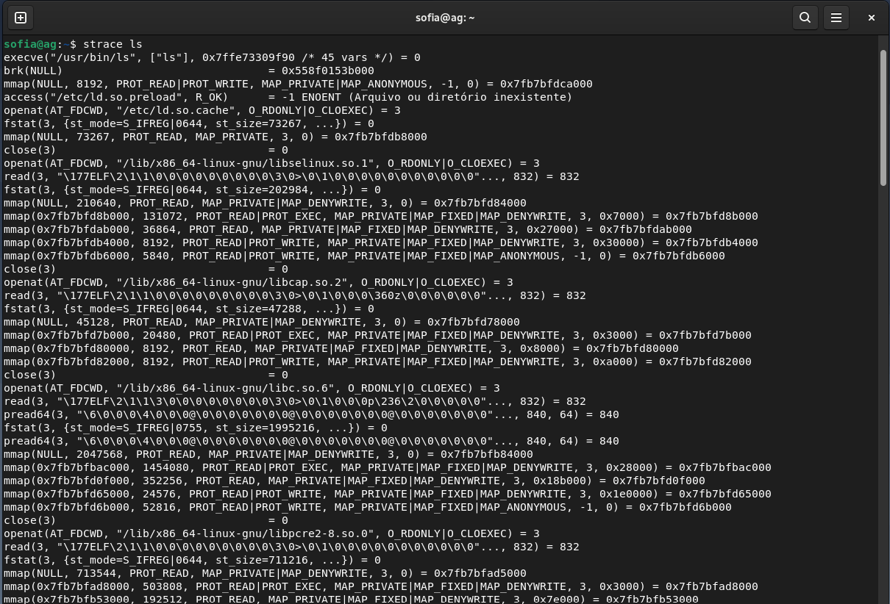
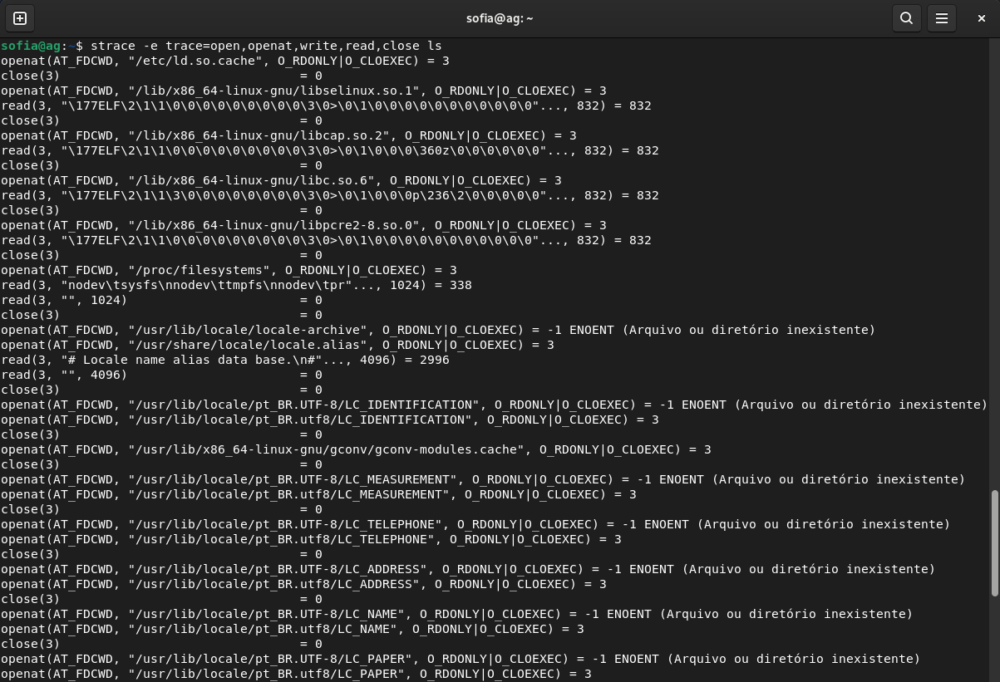
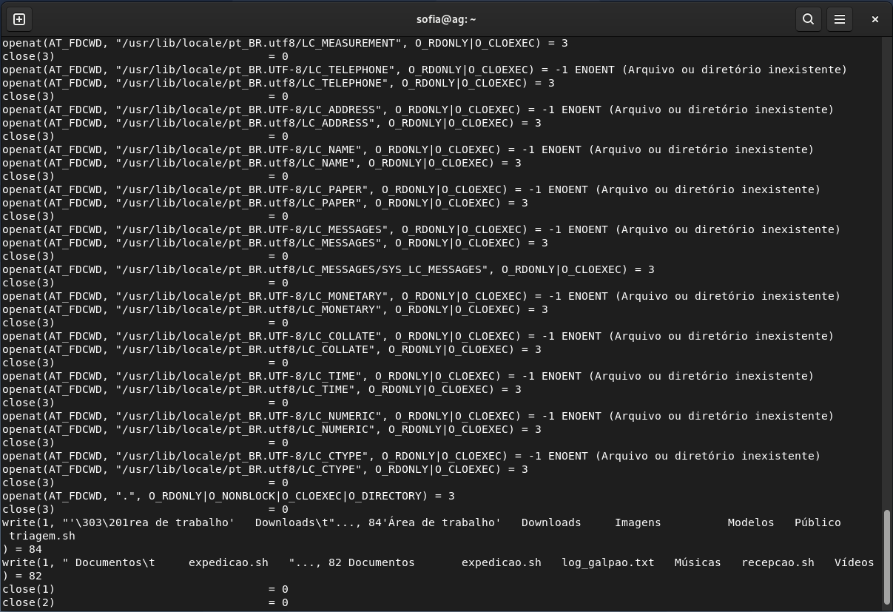

# Como a comunicação entre o software do galpão conversa com o hardware do servidor?

Para garantir qeu a comunicação entre o software e o hardware ocorra de forma segura e sem corromper o sistema de arquivos, utiliza-se o Sistema Operacional(Debian). Ele atua com base no conceito de máquina flexível(ou estendida) e concilia todas as operações por meio das System Calls.

# S.O como uma máquina flexível:

O S.O cria uma camada por cima do hardware para ocultar sua complexidade, apresentando uma interface mais simples e flexível para o desenvolvedor. Assim, em vez do software do galpão ter que lidar com setores físicos, ele ira lidar com arquivos, pastas, conexões de rede e processos.

# A separação dos modos: como o hardware é protegido

Modo de Usuário: É onde o seu software do galpão (o sistema web, o script de triagem, etc.) roda. Nesse modo, o código tem restrições estritas: não pode executar instruções críticas do processador nem acessar o hardware diretamente.

Modo Kernel: É o modo privilegiado onde apenas o núcleo do Sistema Operacional (o Kernel do Debian) executa. Ele tem acesso total a todos os componentes físicos da máquina.

# O papel das System calls:

São usadas quando o software do galpão precisa realizar qualquer ação no mundo físico para salvar um registro de um médico no disco. O software não consegue fazer isso sozinho por estar no modo usuário.

### Permissões que as System Calls precisam pedir para o S.O:

Solicitação: usa o comando *write* para gravar ou *open* para abrir aquivos

troca de modo(TRAP): A System call aciona uma interrupção do hardware/software para fazer a troca do *modo Usuário* para o *modo Kernel*.

Validação e Execução: O kernel do debian assume o controle, verifica se o programa tem permissões para fazer aquela alteração organizando a fila E/S(Entrada/Saída) para evitar que duas operações se colidam e escreve com seguraça os dados do disco rígido.

Retorno: O kernel vai devolver a resposta para o programa e altera a CPU de volta para o modo Usuário.

# Em resumo:

Usando as system Calls, o S.O vai funcionar como um gerente centrral de logística. Todas as solicitações de hardware passam por ele em uma fila organizada e segura, deixando o hardware 100% protegido contra erros de aplicações. 

As Threads (linhas de execução) do galpão rodam no *user space* (Ring 3), 
um ambiente restrito e limitado, sem permissões para gravar diretamente no disco.

As permissões de hardware ficam sob a responsabilidade do kernel (núcleo do 
sistema operacional), que atua no *kernel space* (Ring 0).

Para que um se comunique com o outro, é necessário o uso das *System Calls*. 
É uma instrução especial que provoca a troca do processador do modo usuário 
(Ring 3) para o modo kernel (Ring 0). Nessa transição, o kernel assume o 
controle e realiza a operação em nome da Thread: abre ou cria o arquivo 
(`open`), grava os dados (`write`) e, ao final, fecha o arquivo (`close`). 
O `read` também pode ser usado, caso a Thread precise consultar dados já 
existentes antes de escrever.

As Threads em si não conseguem acessar diretamente o disco, por questões 
de segurança e integridade dos dados, considerando que duas gravações 
simultâneas poderiam corromper o sistema de arquivos.

## Análise das System Calls Observadas

    

Ao executar `strace ls`, é possível observar dezenas de chamadas de sistema
acontecendo em sequência, mesmo para um comando aparentemente simples. Isso
evidencia que o programa `ls`, rodando em *user space*, depende constantemente
do kernel para realizar qualquer operação que envolva hardware ou arquivos.

    

    

* Open / openat — Abertura de arquivos  
O `openat` é a versão moderna do `open`, usada pelo Linux para evitar
condições de corrida ao resolver caminhos relativos. 
* Read — Leitura de dados  
Após abrir cada biblioteca, o processo faz a leitura do seu conteúdo binário
através do descritor retornado pelo `open`/`openat`.
* Write — Escrita de dados  
É a chamada que entrega o resultado do comando ao usuário, escrevendo os
dados no descritor de saída padrão (stdout).
* Close — Fechamento de descritores  
Ao final do uso de cada arquivo, o processo fecha o descritor correspondente,
liberando o recurso.

